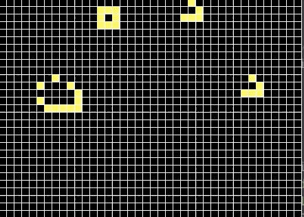

# game of life
A replica of the classic John Conway's Game of Life

## Installation

```git clone https://github.com/YinYin-blip/game_of_life```
```cd game_of_life```
```python -m pip install -r requirements.txt```

## Usage

```python3 main.py```

### Controls:
    - use MOUSE1 to draw the environment
    - press 'p' to let the simulation run continuously (space to stop)


